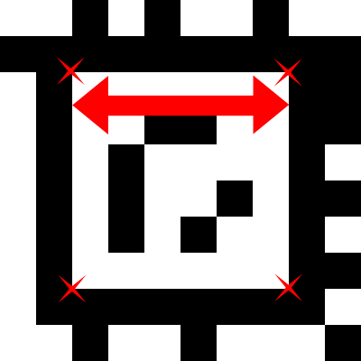

AprilTag 3
==========
AprilTag is a visual fiducial system popular in robotics research. This repository contains the most recent version of AprilTag, AprilTag 3, which includes a faster (>2x) detector, improved detection rate on small tags, flexible tag layouts, and pose estimation. AprilTag consists of a small C library with minimal dependencies.

You can find tag images for the pre-generated layouts [here](https://github.com/AprilRobotics/apriltag-imgs). We recommend using the tagStandard41h12 layout.

Table of Contents
=================
- [Papers](#papers)
- [Install](#install)
- [Usage](#usage)
  - [Choosing a Tag Family](#choosing-a-tag-family)
  - [Getting Started with the Detector](#getting-started-with-the-detector)
    - [Python](#python)
    - [C](#c)
    - [Matlab](#matlab)
    - [Julia](#julia)
  - [Upgrading from AprilTag 2](#upgrading-from-aprilTag-2)
  - [OpenCV Integration](#opencv-integration)
  - [Tuning the Detector Parameters](#tuning-the-detector-parameters)
    - [Increasing speed.](#increasing-speed)
    - [Increasing detection distance.](#increasing-detection-distance)
  - [Pose Estimation.](#pose-estimation)
- [Debugging](#debugging)
- [Flexible Layouts](#flexible-layouts)
- [Support](#support)

Papers
======
AprilTag is the subject of the following papers.

[AprilTag: A robust and flexible visual fiducial system](https://april.eecs.umich.edu/papers/details.php?name=olson2011tags)

[AprilTag 2: Efficient and robust fiducial detection](https://april.eecs.umich.edu/papers/details.php?name=wang2016iros)

[Flexible Layouts for Fiducial Tags](https://april.eecs.umich.edu/papers/details.php?name=krogius2019iros)

Install
=======

Officially only Linux operating systems are supported, although users have had success installing on Windows too.

The default installation will place headers in /usr/local/include and shared library in /usr/local/lib. It also installs a pkg-config script into /usr/local/lib/pkgconfig and will install a python wrapper if python3 is installed.

```
cmake -B build -DCMAKE_BUILD_TYPE=Release
cmake --build build --target install
```
This will build shared (\*.so) libraries by default. If you need static (\*.a) libraries set `BUILD_SHARED_LIBS` to `OFF`:
```
cmake -B build -DCMAKE_BUILD_TYPE=Release -DBUILD_SHARED_LIBS=OFF
cmake --build build --target install
```

If you have Ninja (`sudo apt install ninja-build`) installed, you can use:
```
cmake -B build -GNinja -DCMAKE_BUILD_TYPE=Release
cmake --build build --target install
```
to generate and compile via the ninja build script. It will be much faster than with cmake's default Makefile generator.

You can omit `--target install` if you only want to use this locally without installing.


Usage
=====

## Choosing a Tag Family
For the vast majority of applications, the tagStandard41h12 family will be the correct choice. You can find the images for the tags in the [apriltag-imgs repo](https://github.com/AprilRobotics/apriltag-imgs). Scale up the images in your favorite editor and print them out.

Some heuristics for when to choose other tag families:
1. If you need more tags, use tagStandard52h13
2. If you need to maximize the use of space on a small circular object, use tagCircle49h12 (or tagCircle21h7).
3. If you want to make a recursive tag use tagCustom48h12.
4. If you want compatibility with the ArUcO detector use tag36h11

If none of these fit your needs, generate your own custom tag family [here](https://github.com/AprilRobotics/apriltag-generation).

## Getting Started with the Detector
### Python

    import cv2
    import numpy as np
    from apriltag import apriltag

    imagepath = 'test.jpg'
    image = cv2.imread(imagepath, cv2.IMREAD_GRAYSCALE)
    detector = apriltag("tagStandard41h12")

    detections = detector.detect(image)

Alternately you can use the AprilTag python bindings created by [duckietown](https://github.com/duckietown/lib-dt-apriltags).

### C

    image_u8_t* im = image_u8_create_from_pnm("test.pnm");
    if (im == NULL) {
        fprintf(stderr, "Failed to load pnm image.\n");
        exit(1);
    }
    apriltag_detector_t *td = apriltag_detector_create();
    apriltag_family_t *tf = tagStandard41h12_create();
    apriltag_detector_add_family(td, tf);
    zarray_t *detections = apriltag_detector_detect(td, im);

    for (int i = 0; i < zarray_size(detections); i++) {
        apriltag_detection_t *det;
        zarray_get(detections, i, &det);

        // Do stuff with detections here.
    }
    // Cleanup.
    apriltag_detections_destroy(detections);
    tagStandard41h12_destroy(tf);
    apriltag_detector_destroy(td);

### Matlab

Provided by third-party [here](https://github.com/alddiaz/MATLAB_AprilTag3).

### Julia

Provided by third-party [here](https://github.com/JuliaRobotics/AprilTags.jl)


## Upgrading from AprilTag 2
For most use-cases this should be a drop in replacement.

* The options refine_decode, refine_pose, and black_border have been removed.
* If you have generated your own families, you will need to regenerate the c code for those families. The java code however does not need to be regenerated so this should be quick and easy.


## OpenCV Integration

Note that this library has no external dependencies. Most applications
will require, at minimum, a method for acquiring images.

See example/opencv_demo.cc for an example of using AprilTag in C++ with OpenCV.
This example application can be built by executing the following:

    $ cd examples
    $ make opencv_demo

Image data in a cv::Mat object can be passed to AprilTag without creating
a deep copy. Simply create an image_u8_t header for the cv::Mat data buffer:

    cv::Mat img;

    image_u8_t img_header = { .width = img.cols,
        .height = img.rows,
        .stride = img.cols,
        .buf = img.data
    };


## Tuning the Detector Parameters
### Increasing speed.
Increasing the quad_decimate parameter will increase the speed of the detector at the cost of detection distance.  If you have extra cpu cores to throw at the problem then you can increase nthreads. If your image is somewhat noisy, increasing the quad_sigma parameter can increase speed.

### Increasing detection distance.
First choose an example image and run the detector with debug=1 to generate the debug images. These show the detector's output at each step in the detection pipeline.
If the border of your tag is not being detected as a quadrilateral, decrease quad_decimate (all the way to 1 if necessary).
If the border of the tag is detected then experiment with changing decode_sharpening.

## Pose Estimation.
We provide a method for computing the pose of the tag as follows (alternately use OpenCv's Pnp solver with SOLVEPNP_IPPE_SQUARE). You will need to include the apriltag_pose.h header file and then call the estimate_tag_pose function as follows:

    // First create an apriltag_detection_info_t struct using your known parameters.
    apriltag_detection_info_t info;
    info.det = det;
    info.tagsize = tagsize;
    info.fx = fx;
    info.fy = fy;
    info.cx = cx;
    info.cy = cy;

    // Then call estimate_tag_pose.
    apriltag_pose_t pose;
    double err = estimate_tag_pose(&info, &pose);
    // Do something with pose.
    ...

where the parameters are as follows:
* `det`: The tag detection struct (april_detection_t).
* `tagsize`: The size of the tag in meters. Each tag design has a black border and a white border, but some designs have the white border on the inside and some have the black border on the inside. The tagsize is thus measured from where the two borders meet, see the figure below for an example.
* `fx`, `fy`: The camera's focal length (in pixels). For most cameras `fx` and `fy` will be equal or nearly so.
* `cx`, `cy`: The camera's focal center (in pixels). For most cameras this will be approximately the same as the image center.

Note: The tag size should not be measured from the outside of the tag. The tag size is defined as the distance between the detection corners, or alternately, the length of the edge between the white border and the black border. The following illustration marks the detection corners with red Xs and the tag size with a red arrow for a tag from the 48h12Custom tag family.

 

### Coordinate System
The coordinate system has the origin at the camera center. The z-axis points from the camera center out the camera lens. The x-axis is to the right in the image taken by the camera, and y is down. The tag's coordinate frame is centered at the center of the tag. From the viewer's perspective, the x-axis is to the right, y-axis down, and z-axis is into the tag.

Debugging
=========

You can enable [AddressSanitizer](https://clang.llvm.org/docs/AddressSanitizer.html) to debug memory issues for Debug builds by setting the `ASAN` option:
```
cmake -B build -GNinja -DCMAKE_BUILD_TYPE=Debug -DASAN=ON
cmake --build build
```

Mostly you can then run your executables as usual and inspect the sanitiser output. If you get a message like `ASan runtime does not come first in initial library list; you should either link runtime to your application or manually preload it with LD_PRELOAD.` you have to preload the corresponding `libasan.so.5` like this:
```
LD_PRELOAD=/usr/lib/x86_64-linux-gnu/libasan.so.5 ./build/opencv_demo
```

Flexible Layouts
================
AprilTag 3 supports a wide variety of possible tag layouts in addition to the classic layout supported in AprilTag 2. The tag's data bits can now go outside of the tag border, and it is also possible to define layouts with "holes" inside of the tag border where there are no data bits. In this repo we have included:

* Two families of the new standard layout. This layout adds a layer of data bits around the outside of the tag border, increasing data density, and the number of possible tags, at the cost of a slight decrease in detection distance.
* Two families of circular tags.
* One family which has a hole in the middle. This could be used for example for drone applications by placing different sized tags inside of each other to allow detection over a wide range of distances.

You can generate your own tag families using our other repo, [AprilTag-Generation](https://github.com/AprilRobotics/apriltag-generation).


Support
=======
Please create an issue on this GitHub for any questions instead of sending a private message. This allows other people with the same question to find your answer.
